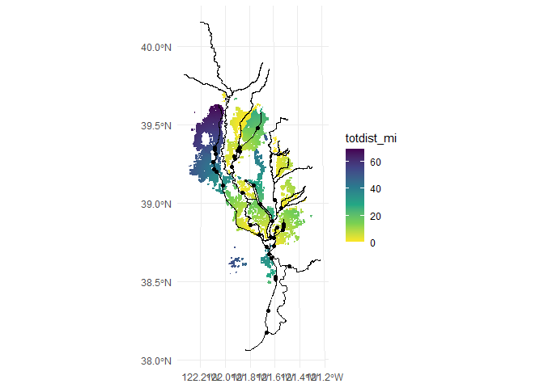
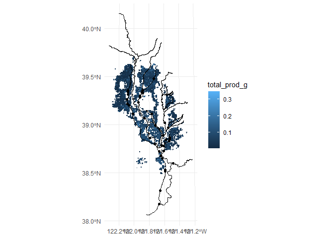
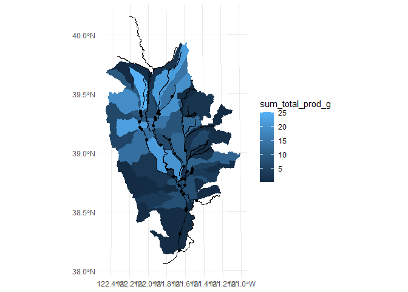
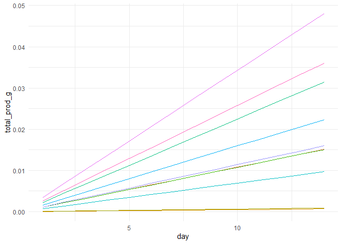

fishFoodMWD
================
2023-08-09

# Import

``` r
library(fishFoodMWD)
```

# Main datasets

``` r
fields
```

    ## Simple feature collection with 10106 features and 5 fields
    ## Geometry type: POLYGON
    ## Dimension:     XYZ
    ## Bounding box:  xmin: 6478160 ymin: 1939404 xmax: 6762226 ymax: 2383039
    ## z_range:       zmin: 0 zmax: 0
    ## Projected CRS: NAD83(2011) / California zone 2 (ftUS)
    ## # A tibble: 10,106 × 6
    ##    unique_id county                          geometry group_id area_ac volume_af
    ##  * <chr>     <chr>         <POLYGON [US_survey_foot]> <chr>      <dbl>     <dbl>
    ##  1 1103539   Glenn  Z ((6526707 2289953 0, 6526695 2… 1802010…   23.4      9.76 
    ##  2 1102849   Glenn  Z ((6517766 2307611 0, 6517767 2… 1802010…   23.5      9.78 
    ##  3 1103353   Glenn  Z ((6501679 2309168 0, 6501671 2… 1802010…    1.06     0.440
    ##  4 1103425   Glenn  Z ((6525986 2324730 0, 6525994 2… 1802010…    1.34     0.558
    ##  5 1103546   Glenn  Z ((6535820 2277869 0, 6535868 2… 1802010…   48.9     20.4  
    ##  6 1103560   Glenn  Z ((6499898 2267008 0, 6499909 2… 1802010…   15.1      6.27 
    ##  7 1103561   Glenn  Z ((6505757 2270476 0, 6504556 2… 1802010…   34.7     14.5  
    ##  8 1103563   Glenn  Z ((6544553 2330567 0, 6544584 2… 1802010…   24.9     10.4  
    ##  9 1103564   Glenn  Z ((6529293 2334151 0, 6529890 2… 1802010…   74.7     31.1  
    ## 10 1103566   Glenn  Z ((6551712 2337179 0, 6552789 2… 1802010…   56.0     23.3  
    ## # ℹ 10,096 more rows

``` r
distances
```

    ## # A tibble: 9,628 × 11
    ##    unique_id return_id ds_fbs_dist return_dis totdist_ft totdist_mi fbs_name    
    ##  * <chr>         <dbl>       <dbl>      <dbl>      <dbl>      <dbl> <chr>       
    ##  1 1103539          49     261359.     41551.     302910       57.4 Lower-mid S…
    ##  2 1102849          49     261359.     60092.     321452       60.9 Lower-mid S…
    ##  3 1103353          49     261359.     69094.     330454       62.6 Lower-mid S…
    ##  4 1103425          50     266763.     69577.     336340       63.7 Lower-mid S…
    ##  5 1103546          50     266763.     21440.     288203       54.6 Lower-mid S…
    ##  6 1103560          49     261359.     41578.     302937       57.4 Lower-mid S…
    ##  7 1103561          49     261359.     38583.     299942       56.8 Lower-mid S…
    ##  8 1103563          50     266763.     74263.     341026       64.6 Lower-mid S…
    ##  9 1103564          50     266763.     77700.     344463       65.2 Lower-mid S…
    ## 10 1103566          50     266763.     81684.     348447       66.0 Lower-mid S…
    ## # ℹ 9,618 more rows
    ## # ℹ 4 more variables: totrect_ft <dbl>, totrect_mi <dbl>, return_rec <dbl>,
    ## #   wet_dry <chr>

``` r
watersheds
```

    ## Simple feature collection with 47 features and 4 fields
    ## Geometry type: POLYGON
    ## Dimension:     XY
    ## Bounding box:  xmin: 6431358 ymin: 1813625 xmax: 6845721 ymax: 2466237
    ## Projected CRS: NAD83(2011) / California zone 2 (ftUS)
    ## # A tibble: 47 × 5
    ##    group_id     huc10      watershed_name    return_id                  geometry
    ##    <chr>        <chr>      <chr>                 <int> <POLYGON [US_survey_foot>
    ##  1 1802015901   1802015901 Honcut Creek              0 ((6723475 2313975, 67235…
    ##  2 1802015902   1802015902 Upper Feather Ri…        14 ((6693728 2351561, 66937…
    ##  3 1802015903   1802015903 Hutchinson Creek…        51 ((6753204 2200420, 67534…
    ##  4 1802015904-N 1802015904 Gilsizer Slough-…        58 ((6668665 2188306, 66550…
    ##  5 1802015905   1802015905 Lower Feather Ri…         0 ((6676057 2172657, 66749…
    ##  6 1802016101   1802016101 Auburn Ravine            55 ((6818743 2102685, 68189…
    ##  7 1802016102   1802016102 Coon Creek               52 ((6764829 2130506, 67649…
    ##  8 1802016103-E 1802016103 Pleasant Grove C…        53 ((6695012 2063232, 66949…
    ##  9 1802016104   1802016104 Curry Creek-Sacr…        56 ((6700483 2053310, 67009…
    ## 10 1802016205   1802016205 Lower Putah Creek        40 ((6527443 1977353, 65274…
    ## # ℹ 37 more rows

``` r
returns
```

    ## Simple feature collection with 38 features and 6 fields
    ## Geometry type: POINT
    ## Dimension:     XY
    ## Bounding box:  xmin: 6534003 ymin: 1826703 xmax: 6710196 ymax: 2299928
    ## Projected CRS: NAD83(2011) / California zone 2 (ftUS)
    ## # A tibble: 38 × 7
    ##    return_name                    return_id ds_return_id ds_fbs_dist ds_fbs_name
    ##  * <chr>                              <int>        <int>       <dbl> <chr>      
    ##  1 Sacramento River Deep Water S…         1            1          0  North Delta
    ##  2 Sankey Diversion                       9            9          0  Lower-mid …
    ##  3 Knights Landing Outfall Gates         10           10          0  Lower-mid …
    ##  4 Rough and Ready Pumping Plant         11           11          0  Lower-mid …
    ##  5 Drainage Pumping Plant RD 70          12           12          0  Upper-mid …
    ##  6 Karnak Drainage Facility              16           16          0  Lower-mid …
    ##  7 Gilsizer Slough to East Borro…        20           16     102506. Lower-mid …
    ##  8 Sutter Bypass to Feather River        21           21          0  Feather Ri…
    ##  9 Wallace Weir                          22            0     213053. North Delta
    ## 10 Fair Ranch Return                     23           23          0  Lower-mid …
    ## # ℹ 28 more rows
    ## # ℹ 2 more variables: geometry <POINT [US_survey_foot]>, return_direct <chr>

# Join structure


# Other layers

``` r
streams
```

    ## Simple feature collection with 41 features and 2 fields
    ## Geometry type: MULTILINESTRING
    ## Dimension:     XY
    ## Bounding box:  xmin: 6466284 ymin: 1783885 xmax: 6784150 ymax: 2546630
    ## Projected CRS: NAD83(2011) / California zone 2 (ftUS)
    ## # A tibble: 41 × 3
    ##    stream_id stream_name                                                geometry
    ##        <int> <chr>                            <MULTILINESTRING [US_survey_foot]>
    ##  1         5 Big Chico Creek            ((6634944 2412054, 6634880 2411933, 663…
    ##  2        14 Stony Creek                ((6466284 2424673, 6466384 2424771, 646…
    ##  3        19 Feather River              ((6708213 2321281, 6708197 2321255, 670…
    ##  4        20 Yuba River                 ((6765041 2210830, 6764851 2210882, 676…
    ##  5        23 American River             ((6784150 1994710, 6783549 1994508, 678…
    ##  6        18 Bear River                 ((6699127 2118467, 6699117 2118443, 669…
    ##  7        16 Upper-mid Sacramento River ((6504256 2546317, 6504261 2546312, 650…
    ##  8        21 Lower-mid Sacramento River ((6610934 2130554, 6610932 2130547, 661…
    ##  9        32 North Delta                ((6703899 1929980, 6704334 1928120, 670…
    ## 10        24 Lower Sacramento River     ((6702038 1979678, 6702148 1979453, 670…
    ## # ℹ 31 more rows

``` r
canals
```

    ## Simple feature collection with 80 features and 2 fields
    ## Geometry type: LINESTRING
    ## Dimension:     XY
    ## Bounding box:  xmin: 6534003 ymin: 1826703 xmax: 6697335 ymax: 2355630
    ## Projected CRS: NAD83(2011) / California zone 2 (ftUS)
    ## # A tibble: 80 × 3
    ##    canal_id canal_name                                                  geometry
    ##       <int> <chr>                                  <LINESTRING [US_survey_foot]>
    ##  1        9 Natomas Cross Canal               (6695945 2064719, 6695220 2064156)
    ##  2        9 Natomas Cross Canal             (6695220 2064156, 6676008 2049240, …
    ##  3       10 Main Canal                      (6682739 2069936, 6682816 2069795, …
    ##  4       10 Main Canal                      (6682832 2069755, 6682888 2069618, …
    ##  5       11 Hunters Creek 2 Diversion Canal   (6537828 2250408, 6537754 2250409)
    ##  6       13 Main Drainage Levee Canal       (6595410 2245915, 6595123 2245630, …
    ##  7       15 Colusa Basin Drainage Canal     (6567696 2129923, 6571230 2125974, …
    ##  8       26 East Borrow Ditch               (6641825 2125063, 6641048 2126700, …
    ##  9       26 East Borrow Ditch               (6627738 2168387, 6627205 2167714, …
    ## 10       28 West Borrow Ditch               (6612131 2135695, 6612545 2135929, …
    ## # ℹ 70 more rows

# Plotting

``` r
plot_fields()
```

<!-- -->

``` r
plot_distances()
```

<!-- -->

``` r
plot_watersheds()
```

<!-- -->

# Calculations

Moss et al. (2009) estimated that invertebrate biomass in flooded
post-harvest agricultural fields increased at an average rate of 0.186
g/m^2 per day.

How much invertebrate biomass is produced by each field in 14 days?

``` r
fields |> 
  calc_inv_mass(14) |>
  ggplot() + 
    geom_sf(aes(fill = total_prod_g, color = total_prod_g)) + 
    geom_sf(data=streams) + geom_sf(data=canals) + geom_sf(data=returns) 
```

<!-- -->

Which watersheds produce the most invertebrate biomass?

``` r
total_prod_by_group <- fields |> 
  calc_inv_mass(14) |>
  group_by(group_id) |> 
  summarize(sum_total_prod_g = sum(total_prod_g)) |>
  st_drop_geometry()

watersheds |> 
  left_join(total_prod_by_group) |>
  ggplot() + 
    geom_sf(aes(fill = sum_total_prod_g, color = sum_total_prod_g)) + 
    geom_sf(data=streams) + geom_sf(data=canals) + geom_sf(data=returns) 
```

<!-- -->

Growth in biomass over time by field

``` r
fields |> 
  head(n = 10) |>
  calc_inv_mass_ts(14) |>
  ggplot() + geom_line(aes(x=day, y=total_prod_g, color=unique_id)) + guides(color="none")
```

<!-- -->
