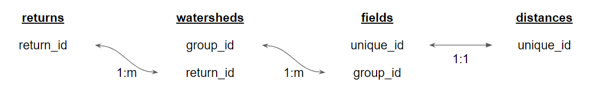

```{r setup, include = FALSE}
knitr::opts_chunk$set(
  collapse = TRUE,
  comment = "#>",
  fig.width=680/72,
  fig.height=680*(2/3)/72,
  dpi=72
)
ggplot2::theme_set(ggplot2::theme_minimal())
library(tidyverse)
library(sf)
library(fishFoodMWD)
```

This vignette describes the structure of provided datasets and the possibilities for joining these datasets for further analysis.

## Introduction 

Four core datasets are provided: `returns`, `watersheds`, `fields`, and `distances`. The first three are spatial `sf` data frames while `distances` is an ordinary `tibble` data frame.

| dataset      | type         | unique id field | description |
| ------------ | ------------ | --------------- | ----------- |
| `returns`    | `sf` Point   | `return_id`     | Return point geometries, flow types, indirect flow distances, and downstream `return_id`s |
| `watersheds` | `sf` Polygon | `group_id`      | Watershed geometries and return point `return_id`s |
| `fields`     | `sf` Polygon | `unique_id`     | Rice field geometries, areas, and watershed `group_id`s |
| `distances`  | `tibble`     | `unique_id`     | Rice field distance calculation results |

These four datasets are heirarchically nested and can be joined to each other using the indicated `*_id` fields in order to access all required data. 

{width=100%}

Finally, additional `sf` geometry layers are provided for basemap and context purposes. These are:

| dataset      | type         | description |
| ------------ | ------------ | ----------- |
| `streams`    | `sf` Line    | Fish-bearing streams |
| `canals`     | `sf` Line    | Selected secondary canals that connect indirect return points to their downstream returns to fish-bearing streams |
| `wetdry`     | `sf` Polygon | Polygons indicating the "wet" and "dry" areas of the Sacramento Valley based on levee locations |


## Core datasets

Following are previews of the four core datasets

```
watersheds
```
```{r dataset-watersheds, echo=FALSE}
watersheds |> head(5) |> knitr::kable()
```

```
returns
```
```{r dataset-returns, echo=FALSE}
returns |> head(5) |> knitr::kable()
```

```
fields
```
```{r dataset-fields, echo=FALSE}
fields |> head(5) |> knitr::kable()
```

```
distances
```
```{r dataset-distances, echo=FALSE}
distances |> head(5) |> knitr::kable()
```

# Example joins

Following are example procedures used to join the different datasets.

These example assume that the `tidyverse` stack and `sf` spatial library have been imported.
```
library(tidyverse)
library(sf)
```

To access information about a watershed's return flow, join the `watersheds` dataset to the `returns` dataset using `return_id`. Note that running `dplyr::left_join` on an `sf` object requires first converting it to an ordinary tibble using `sf::st_drop_geometry()`.

```{r join-watersheds-returns, message=FALSE, warning=FALSE}
watersheds_returns <- watersheds |> 
  left_join(st_drop_geometry(returns), by=join_by(return_id)) 

ggplot() + 
  geom_sf(data=watersheds_returns, aes(fill=return_direct)) + 
  geom_sf_text(data=st_centroid(watersheds_returns), aes(label=return_id))
```

To access information about a rice field's watershed, join the `fields` dataset to the `watersheds` dataset using `group_id`.
```{r join-fields-watersheds, message=FALSE, warning=FALSE}
fields_watersheds <- fields |> 
  left_join(st_drop_geometry(watersheds), by=join_by(group_id))

ggplot() + geom_sf(data=fields_watersheds, aes(fill=watershed_name), color=NA)
```

To access information about a rice field's return flow, first join the `fields` dataset to the `watersheds` dataset using `group_id`. Now that watershed information is joined, join to the `returns` dataset using `return_id`.
```{r join-fields-returns, message=FALSE, warning=FALSE}
fields_returns <- fields |> 
  left_join(st_drop_geometry(watersheds), by=join_by(group_id)) |> 
  left_join(st_drop_geometry(returns), by=join_by(return_id))

ggplot() + 
  geom_sf(data=fields_returns, aes(fill=return_direct), color=NA)

```

To access the fields distance calculation results, simply join `fields` to `distances` on `unique_id`.
```{r join-fields-distances, message=FALSE, warning=FALSE}
fields_distances <- fields |> 
  left_join(distances, by=join_by(unique_id))

ggplot() + 
  geom_sf(data=fields_distances, aes(fill=totdist_mi), color=NA)

```

## Basemap layers

The `streams` and `canals` layers display the geometries of the fish-bearing streams and secondary canals.

```
streams
```
```{r dataset-streams, echo=FALSE}
streams |> head(5) |> knitr::kable()
```

```
canals
```
```{r dataset-canals, echo=FALSE}
canals |> head(5) |> knitr::kable()
```

These are recommended to be plotted along with the return points, with corresponding coloration by `Direct` flow to fish-bearing `streams` and `Indirect` flow to secondary `canals`.
```{r dataset-streams-canals-returns, message=FALSE, warning=FALSE}
ggplot() + 
  geom_sf(data=streams, aes(color="Direct")) + 
  geom_sf(data=canals, aes(color="Indirect")) + 
  geom_sf(data=returns, aes(color=return_direct))
```
